<!--
Configuration
=============
- Every slide taken "directly from the PDF" shows a given page of
  presentation_base.pdf as a pre-rendered JPG via
  .
  This used to be a live <iframe> straight into the PDF, but mobile
  browsers (iOS Safari, Android Chrome) have no built-in PDF viewer plugin
  for iframes — they just showed a fallback "open presentation_base.pdf"
  link there instead of the page. Pre-rendered images work everywhere.
  This DOES mean the images go stale when presentation_base.pdf changes —
  run `python3 marp/render_pdf_pages.py` afterwards to regenerate every
  pdf_pages/page-N.jpg (it renders every page of the PDF, not just the
  ones used below).
- To choose which pages appear, just add/remove/reorder the slides below —
  each one is a single  line,
  plus the slide-class comment above it. The data-pdf-page attribute must
  match the real page number of the PDF, which is also the filename
  (pdf_pages/page-N.jpg is always PDF page N).
- presentation_base.pdf currently has 31 pages. The title slide always
  shows page 3 (title/authors/logos). Any slide that does NOT come
  directly from the PDF (e.g. the map slide) must use class "custom-slide"
  and show the PDF's LAST page (currently 31) as its background — update
  that page number here if pages are added/removed from the PDF.
- The footer text in the front matter above (and the page number next to
  it, bottom-left on every slide) is set once per presentation — edit the
  `footer:` value before presenting. Both are suppressed on the title
  slide via local "_footer" and "_paginate" directive comments — always
  use the underscore-prefixed local form there, since a non-prefixed
  directive changes the value for every following slide too, not just
  that one.
- Map slides: give the <iframe class="map-embed"> a data-layer attribute
  to control which loop layer it opens on. This never touches loop_map.html
  itself (opened normally/directly it still starts on its own default
  layer) — the wiring script at the bottom of this file only reaches into
  the embedded iframe copy on this specific slide, via postMessage (works
  across the file:// origin boundary, unlike direct DOM access). Valid
  values (see LAYER_NAMES in loop_map.html):
    producer  -> Produzentschleifen
    consumer  -> Verbraucherschleifen
    custom_0  -> Landwirtschaft
    custom_1  -> Stift Tilbeck
    custom_2  -> Restaurants
    custom_3  -> Lebensmittelhandel
  Add more map slides the same way, just with a different data-layer.
-->

<!-- _class: title -->
<!-- _footer: "" -->
<!-- _paginate: false -->

---

<!-- _class: pdf-page -->

---

<!-- _class: pdf-page -->
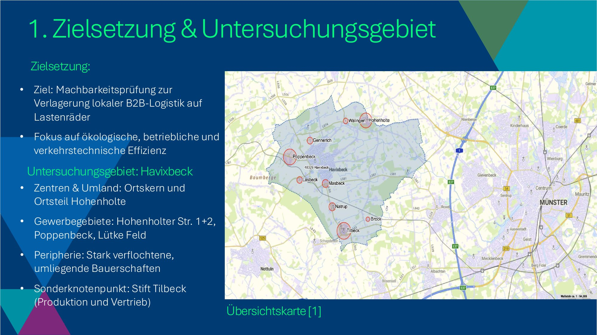

---

<!-- _class: pdf-page -->

---

<!-- _class: pdf-page -->
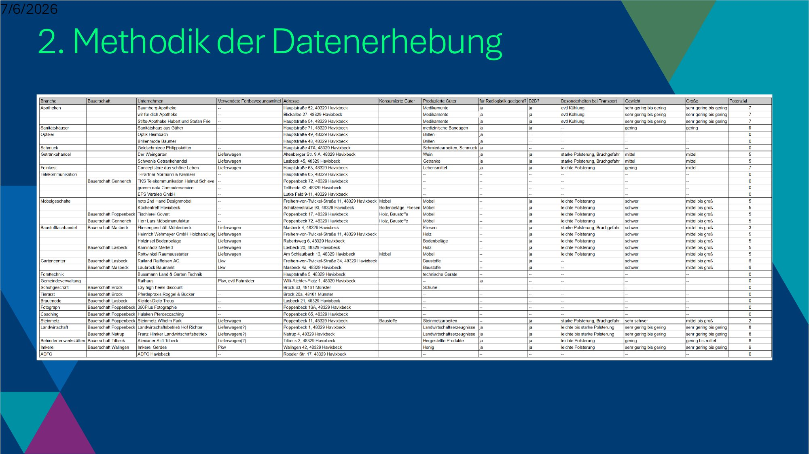

---

<!-- _class: pdf-page -->
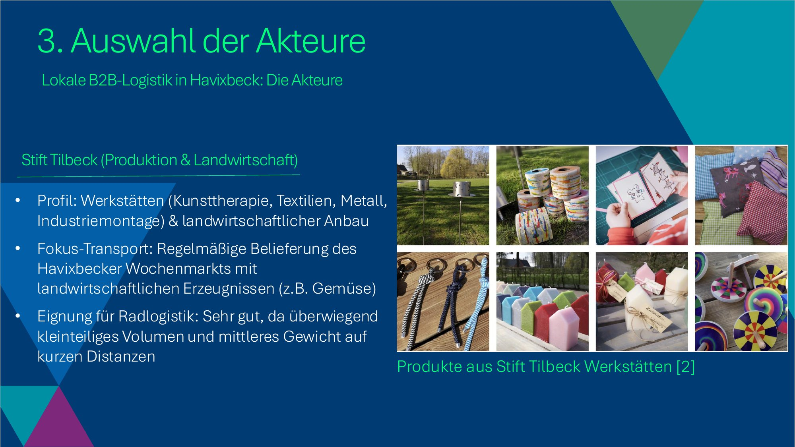

---

<!-- _class: pdf-page -->
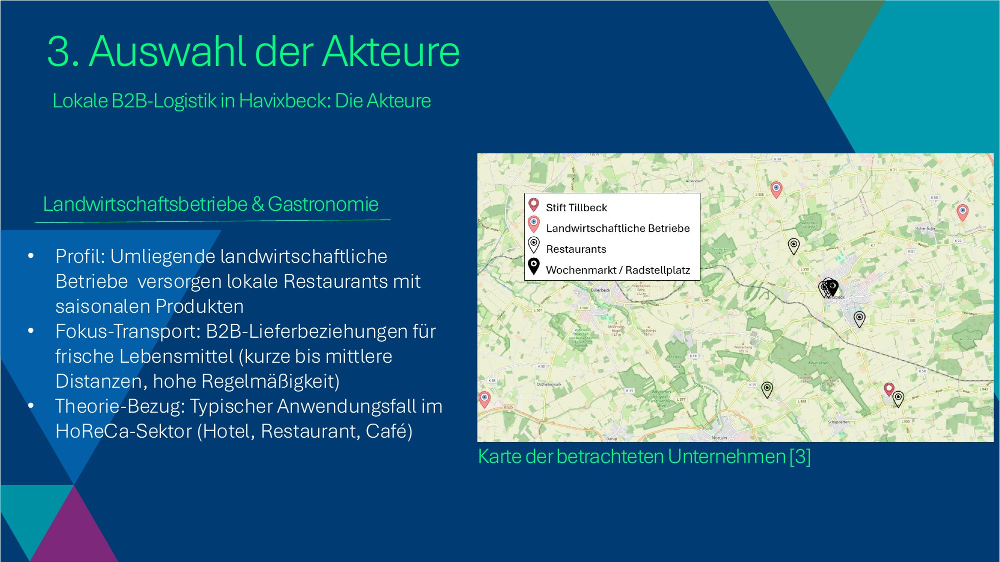

---

<!-- _class: pdf-page -->

---

<!-- _class: pdf-page -->

---

<!-- _class: pdf-page -->

---

<!-- _class: pdf-page -->

---

<!-- _class: pdf-page -->
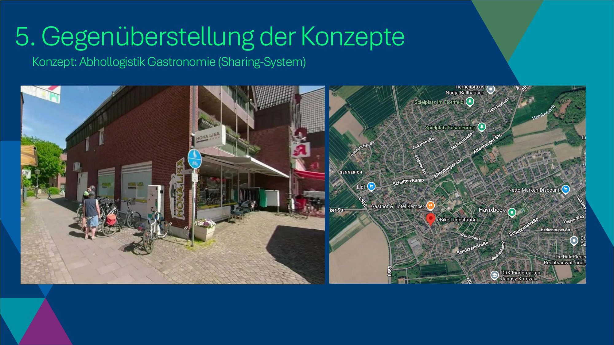

---

<!-- _class: pdf-page -->
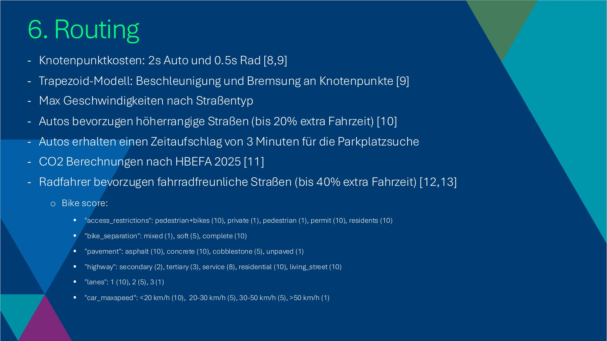

---

<!-- _class: custom-slide map-slide -->

  <iframe class="map-embed" data-layer="custom_2" src="../poi_map.html"></iframe>

---

<!-- _class: pdf-page -->
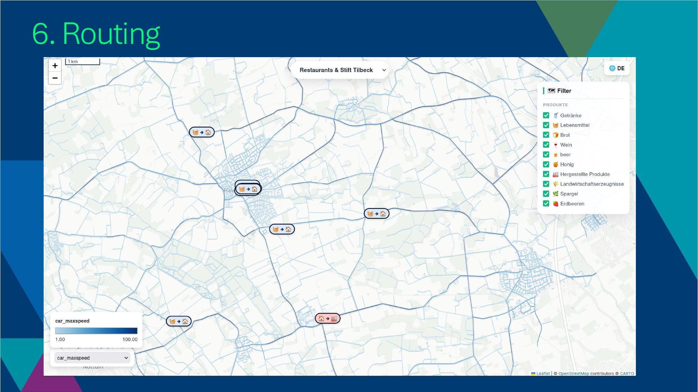

---

<!-- _class: pdf-page -->
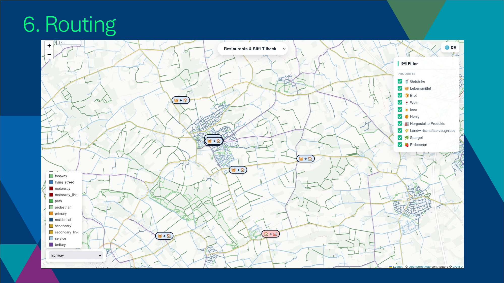

---

<!-- _class: pdf-page -->
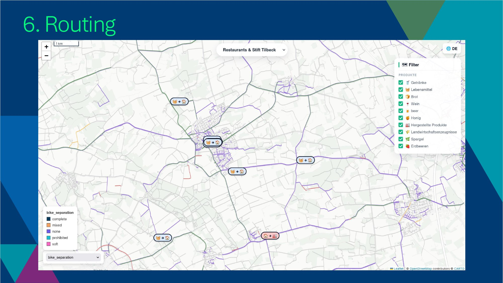

---

<!-- _class: pdf-page -->
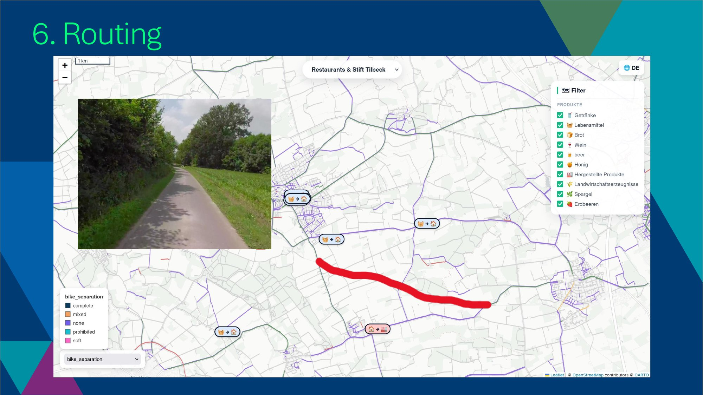

---

<!-- _class: pdf-page -->
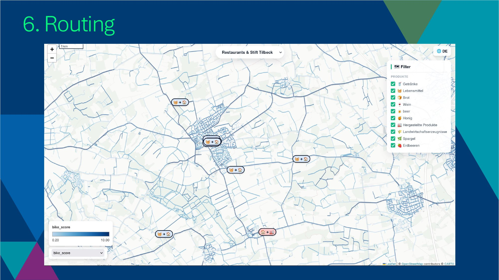

---

<!-- _class: custom-slide map-slide -->

  <iframe class="map-embed" data-layer="custom_2" src="../loop_map.html"></iframe>

---

<!-- _class: pdf-page -->
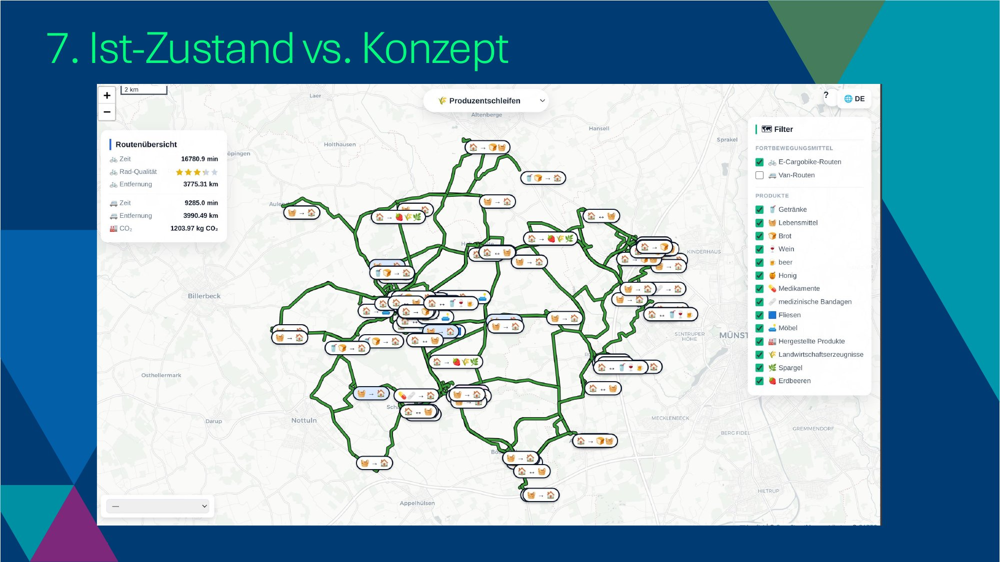

---

<!-- _class: pdf-page -->
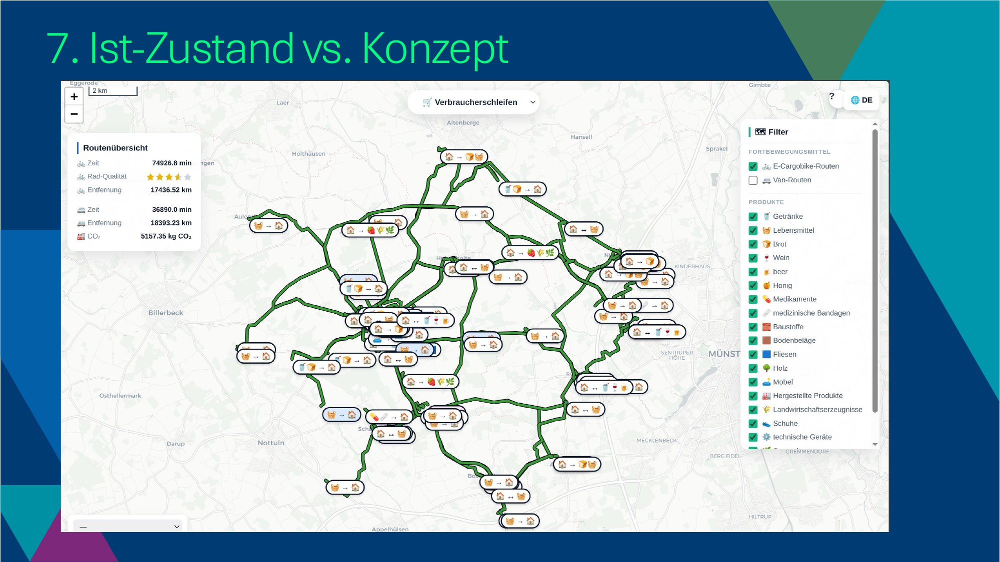

---

<!-- _class: pdf-page -->
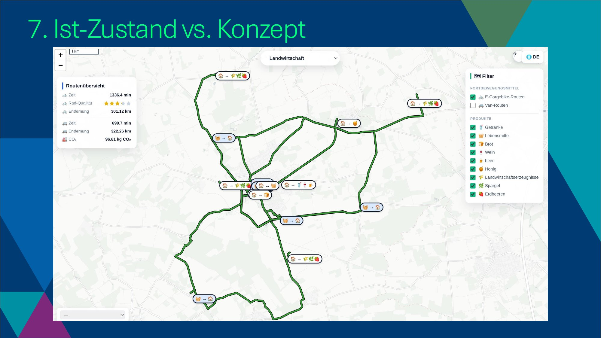

---

<!-- _class: pdf-page -->
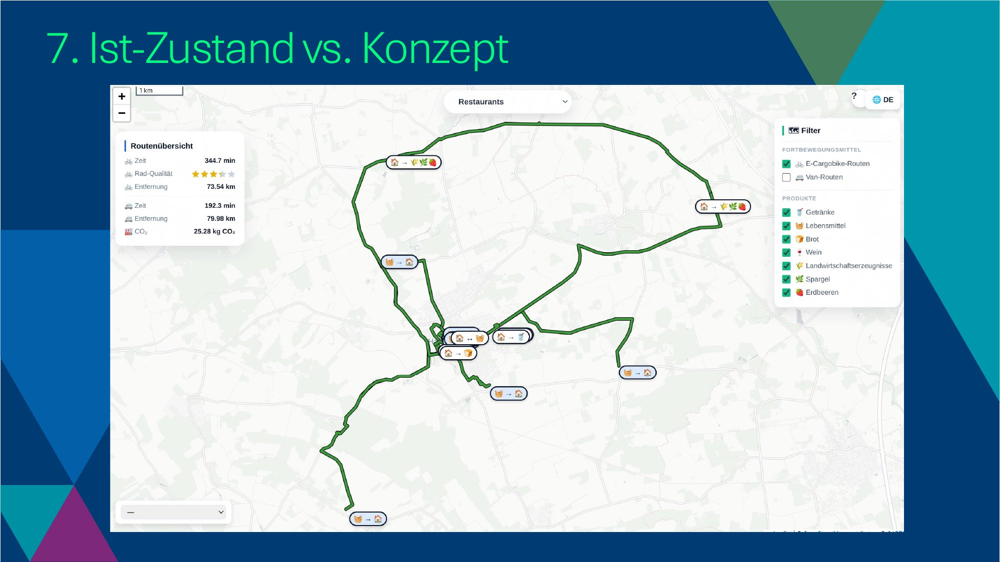

---

<!-- _class: pdf-page -->
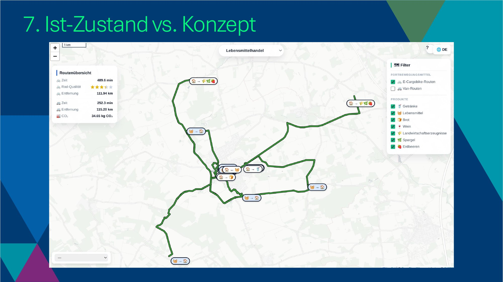

---

<!-- _class: pdf-page -->
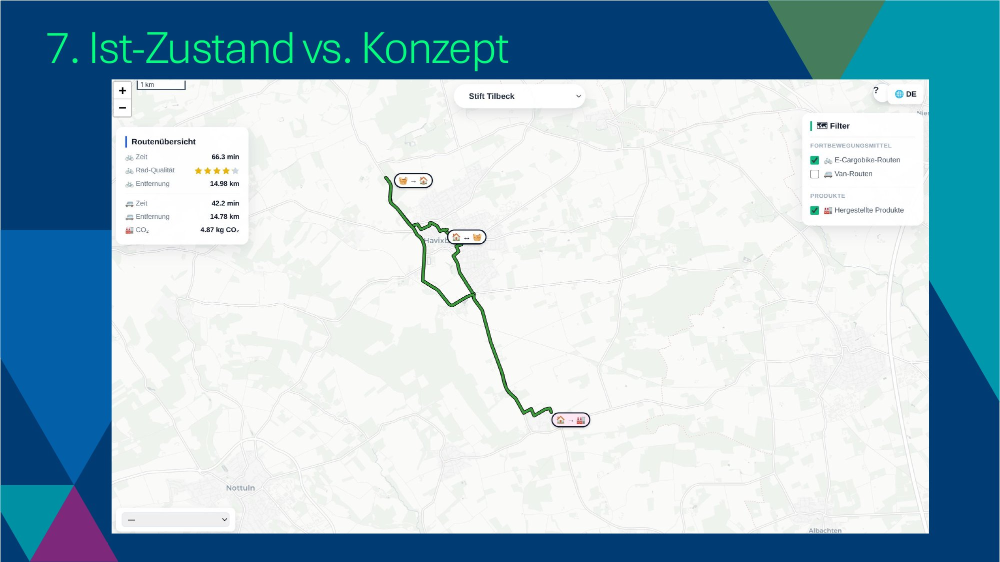

---

<!-- _class: pdf-page -->

---

<!-- _class: pdf-page -->

